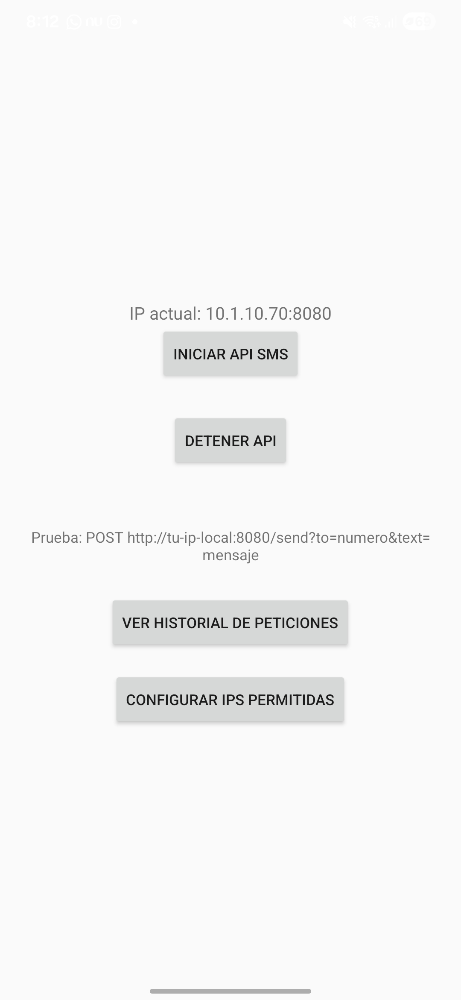
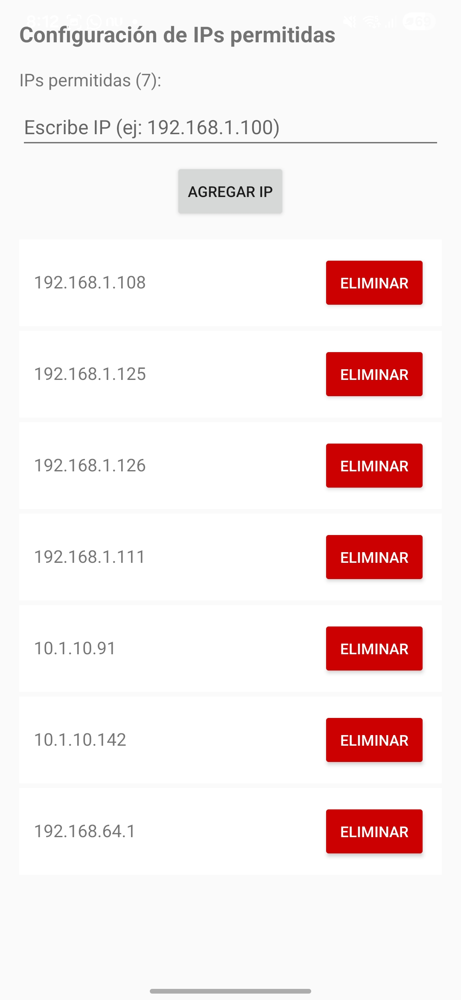

# SmsApiNano

SmsApiNano es una aplicación para Android que te permite enviar SMS programáticamente utilizando la API de NanoHttpd.

## Características

* Envío de SMS programático
* Utiliza la API de NanoHttpd para establecer una conexión con el servidor de mensajes
* Soporta envío de SMS locales e internacionales
* Permite especificar el número de teléfono del destinatario y el mensaje a enviar
* Permite mostrar historial del envío
* Permite cancelar el envío en cualquier momento

## Capturas de pantalla

## Instalación

Puedes instalar la aplicación desde el repositorio de GitHub.

## Uso

1. Abre la aplicación
2. Inicia el server
3. Añade la ip de origen del dispositivo que hará la petición
4. Prepara la petición post a la ip del celular
5. Envía mensajes
5. Puedes detener el servidor en cualquier momento

## Licencia

No contiene ninguna licencia, es open source para pruebas o uso académico

## Autor

SmsApiNano ha sido creado por Diego Morales (diemoret17@gmail.com)
